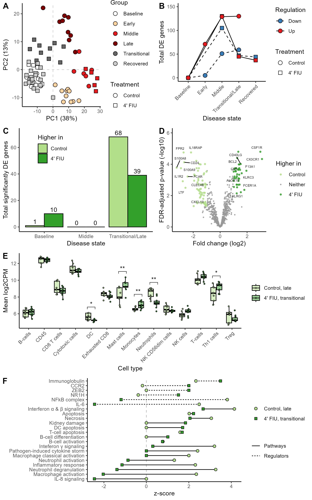

# 4' FIU antiviral rescues AGMs from Lassa fever: Nanostring transcriptomic analyses

> Paper citation TBD

## Methods

The expression of 770 host mRNAs was quantified via the Nanostring NHP Immunology v2 panel according to the manufacturer’s instructions. Raw RCC files were loaded into [nSolver v4.0](https://nanostring.com/products/ncounter-analysis-system/ncounter-analysis-solutions/), and background thresholding was performed using the default parameters. Samples that did not pass the nSolver internal quality checks were removed. Thresholded count matrices were exported from nSolver and analyzed with [limma v3.62.1](https://doi.org/10.1093/nar/gkv007) ([edgeR v4.4.1](https://doi.org/10.1093/bioinformatics/btp616)) in R v4.4.2​.

Naïve clustering with principal component analysis (PCA) and k-means was used to bin time points into six disease states: baseline (0 DPI), early (3-4 DPI), middle (7 DPI), late (>7 DPI in controls), transitional (9-12 DPI in treated), and recovered (≥15 DPI in treated) (Figure A). The disease course in control and treated animals was defined by comparing each disease state to baseline (Figure B). Differences in disease course between control and treated animals were quantified by comparing groups at baseline, middle, and transitional/late disease stages (Figure C-D). Few-to-no differences were identified at baseline and mid-disease; however, the host response diverged at after 7 DPI (terminal in controls, transitional 9 & 12 DPI in treated).

## Data availability

The raw RCC files are available via NCBI GEO (accession TBD). The unformatted output figures are in [`analysis`](analysis/). The code is in [`limma.r`](limma.r). 

 

